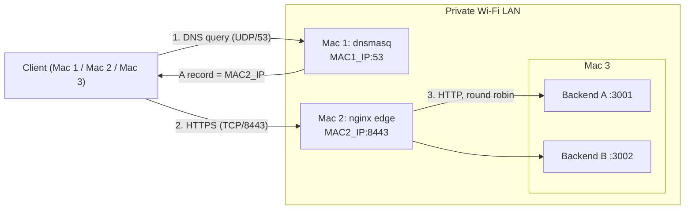
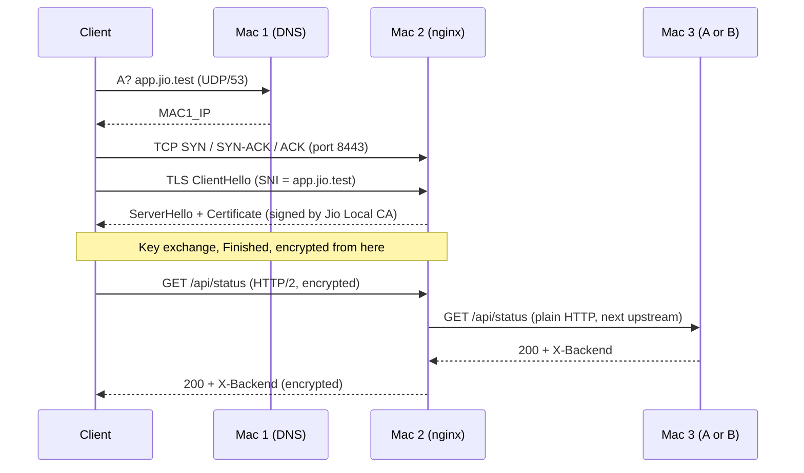

# Architecture: Team Jio, Phase 1

A private three-Mac LAN that mimics a small cloud deployment: private DNS, a TLS-terminating load balancer, and two application backends.

**Goal:** a client resolves `app.jio.test`, connects over HTTPS to `:8443`, and receives responses from both backends in turn.

## 1. Topology

## 2. Machines and Addresses

| Machine | Role | 
| --- | --- |
| Mac 1 | DNS server + client 
| Mac 2 | nginx edge (LB + TLS) + client 
| Mac 3 | Backend A + B + client 

## 3. Components

| Component | Software | Listens on | Job |
| --- | --- | --- | --- |
| DNS | dnsmasq | MAC1_IP:53 (UDP/TCP) | Answers `app.jio.test` and `api.jio.test` with Mac 2's IP; forwards all other names to 8.8.8.8 |
| Edge | nginx 1.31 | :8080 (redirect), :8443 (TLS) | Terminates TLS, load-balances across backends, redirects HTTP to HTTPS |
| Backend A | `server.py A 3001` | 0.0.0.0:3001 | Serves `/`, `/api/status`, `/api/static`; adds `X-Backend: A` |
| Backend B | `server.py B 3002` | 0.0.0.0:3002 | Same code, adds `X-Backend: B` |
| CA | OpenSSL, "Jio Local CA" | n/a | Signs the server certificate; trusted in every client's System Keychain |

## 4. Request Flow

### Layer map

| Layer | What happens here | Protocol / port |
| --- | --- | --- |
| Application | Name lookup; the web request | DNS (UDP/53), HTTP/2 |
| Security | Server authentication and encryption | TLS 1.2 / 1.3 |
| Transport | Reliable connection to the edge | TCP 8443 (DNS uses UDP 53) |
| Network | Host addressing | IPv4 (10.7.x.x) |
| Link | Frames over the LAN | Wi-Fi (en0) |

TLS ends at nginx. The hop from nginx to the backends is plain HTTP inside the LAN.

## 5. Configuration Summary

**dnsmasq (Mac 1).** `listen-address` is Mac 1's IP plus 127.0.0.1. Two `host-record` lines map `app.jio.test` and `api.jio.test` to Mac 2. `no-resolv` with `server=8.8.8.8` forwards everything else, so internet access keeps working. Clients use it because their Wi-Fi DNS server is set to Mac 1.

**nginx (Mac 2).**
- `upstream app_backend` lists both backends with `max_fails=2 fail_timeout=10s`. Selection is round robin.
- The `:8080` server returns a 301 redirect to `https://$host:8443$request_uri`.
- The `:8443` server holds the certificate and key, allows TLS 1.2 and 1.3, enables HTTP/2, and proxies with `proxy_pass http://app_backend`.
- `proxy_set_header` passes `Host`, `X-Real-IP`, `X-Forwarded-For` and `X-Forwarded-Proto` to the backend.
- `proxy_connect_timeout 2s` and `proxy_next_upstream error timeout http_502 http_503` retry a failed request on the other backend.

**Backends (Mac 3).** One stdlib Python script run twice with different ID and port. `/api/status` returns `Cache-Control: no-store`. `/api/static` returns `Cache-Control: max-age=60` and an `ETag`, and a 304 when `If-None-Match` matches. The ETag is computed from the body, so both backends produce the same value.

## 6. Security Design

- A private CA (`Jio Local CA`) signs one server certificate with SANs `app.jio.test` and `api.jio.test`. Browsers validate the SAN, not the CN.
- Only `ca.crt` is distributed. `ca.key` stays on Mac 2 and is never committed.
- Each client installs the CA with `security add-trusted-cert` into the System Keychain, so no `-k` is needed. A client without the CA gets a verification error, which proves validation is real.
- Certificate lifetime: server certificate 90 days, CA 365 days.

## 7. Caching

| Endpoint | Headers | Client behaviour |
| --- | --- | --- |
| `/api/static` | `Cache-Control: max-age=60`, `ETag` | within 60 s served from cache; afterwards a conditional request gets `304 Not Modified` |
| `/api/status` | `Cache-Control: no-store` | always a full request |

nginx does not cache. Caching happens in the client (browser or curl).

## 8. Load Balancing and Failure Behaviour

| Situation | Result | Why |
| --- | --- | --- |
| Both backends up | Responses alternate A, B, A, B | round robin |
| One backend down | All requests still `200` from the survivor; one short delay at most | passive health check (`max_fails`) plus `proxy_next_upstream` |
| Both down | `502 Bad Gateway` from nginx | DNS, TCP and TLS still succeed; failure is behind the edge |
| Wrong client DNS | Name fails, pinging the IP still works | DNS and IP reachability are independent |
| Wrong DNS record | Name resolves to a wrong address, then timeout or refusal | DNS is a directory, not a connection |
| Wrong port | Connection refused, host still reachable | ports identify services, IPs identify hosts |

## 9. Cloud Equivalents

| Our lab | In the cloud |
| --- | --- |
| dnsmasq on Mac 1 | Route 53 / private hosted zone |
| nginx on Mac 2 | Application Load Balancer or CDN edge (TLS termination) |
| `upstream` block | ALB target group |
| `max_fails` / `fail_timeout` | target health checks |
| Backends on Mac 3 | EC2 instances / containers |
| Jio Local CA | ACM / a public CA |
| Wi-Fi LAN | VPC subnet |

## 10. Start Order and Dependencies

DNS first, then backends, then the edge, then clients.

1. Mac 1: `sudo brew services start dnsmasq`; check `dig @10.7.22.173 app.jio.test +short`
2. Mac 3: `python3 server.py A 3001` and `python3 server.py B 3002`
3. Mac 2: `sudo nginx -t && sudo nginx`
4. Clients: `sudo networksetup -setdnsservers Wi-Fi 10.7.22.173`, then flush the DNS cache
5. Verify: `/usr/bin/curl -sI https://app.jio.test:8443/api/status | grep -i x-backend`

Shutdown reverses this and restores each client's DNS with `sudo networksetup -setdnsservers Wi-Fi Empty`.

## 11. Repository and Evidence Map

| Path | Contents |
| --- | --- |
| `configs/` | `dnsmasq.conf`, `nginx.conf`, certificate notes (no private keys) |
| `backend/` | `server.py` and run instructions |
| `scripts/` | start and stop scripts per Mac |
| `evidence/01_lan` … `08_failures` | IP table, DNS, backends, load balancer, TLS, cache, pcaps, failure demos |
| `docs/architecture.md` | this document |

## 12. Assumptions and Limits

- Single point of failure: DNS (Mac 1) and the edge (Mac 2) have no redundancy in Phase 1.
- Both backends run on one machine (Mac 3), so a Mac 3 failure takes both down.
- Ports 8080/8443 are used instead of 80/443.
- Backends are reached over plain HTTP inside the LAN.